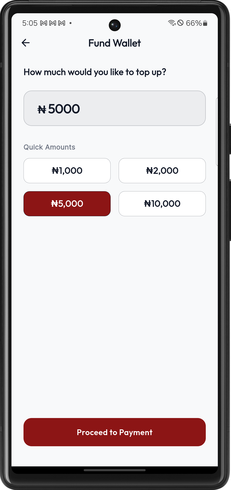
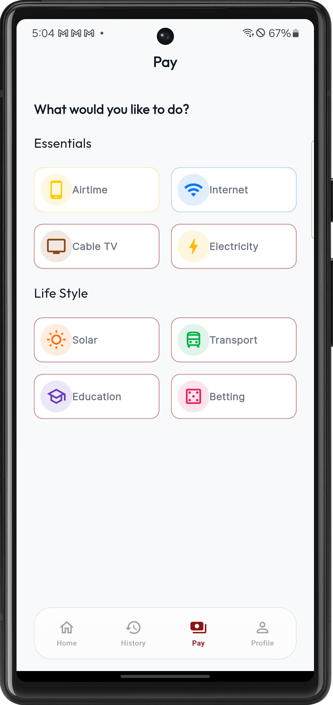
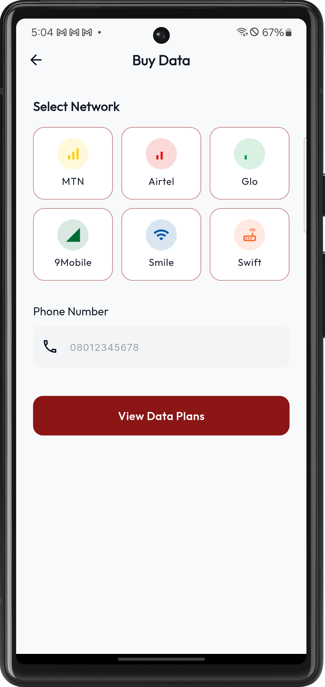
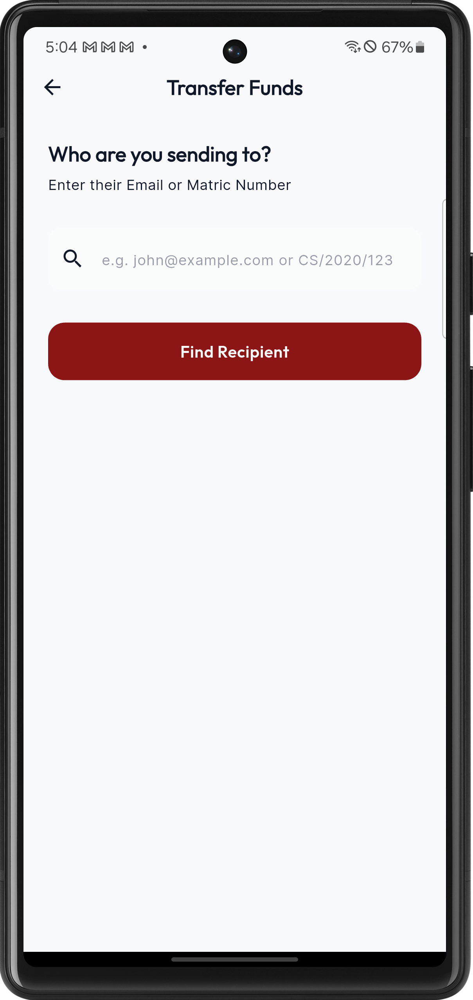
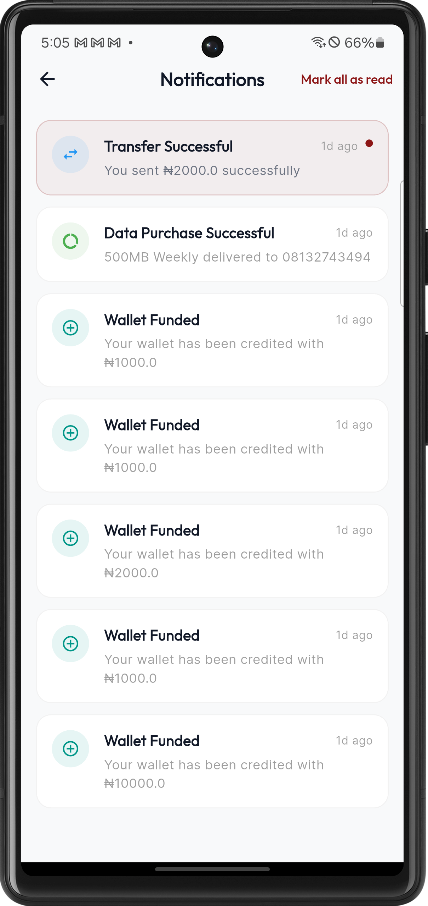
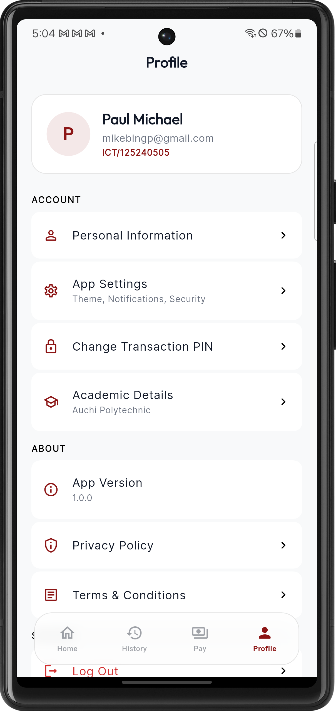
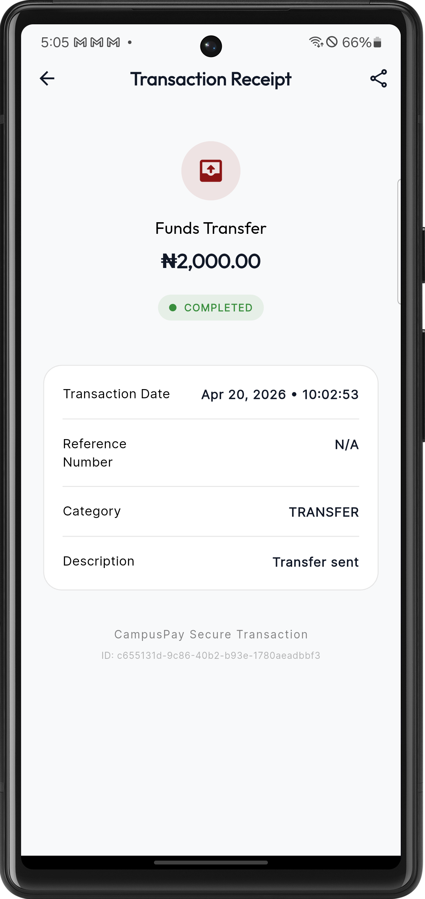

# CampusPay

A comprehensive, clean-architecture based Flutter application for campus financial management. CampusPay seamlessly connects university students with quick, secure, and intuitive digital financial services—ranging from wallet funding, peer-to-peer transfers, data/airtime top-ups, to institution fee payments.

## 📸 Screenshots

<p align="center">
  
  
  
</p>
<p align="center">
  
  
  
</p>
<p align="center">
  
  
  
</p>

## ✨ Features

- **Authentication & Security:** Secure login/registration flows, email verification, password recovery via deep links, and mandatory transaction PIN configuration.
- **Wallet System:** Fund smart wallets and perform real-time internal peer-to-peer transfers seamlessly.
- **Utility Payments:** Integrated services to purchase mobile data bundles and airtime for various network providers seamlessly.
- **Fee Payments:** Quick processing of university utility/remita (RRR) fee payments.
- **Profile Management:** Dynamic user profiles containing personal information and detailed academic details, editable via an intuitive interface.
- **Transaction History:** Categorized views of past and pending transactions, complete with detailed digital receipts.
- **Notifications:** Push and in-app notifications for payment resolutions and system alerts.
- **Premium UI:** Aesthetic, theme-aware responsive UI built securely adopting the Material 3 design system.

## 🛠 Technology Stack

- **Framework:** [Flutter](https://flutter.dev/) (Dart) 
- **Backend/BaaS:** [Supabase](https://supabase.com/) (PostgreSQL, Authentication & RLS)
- **State Management:** [flutter_bloc](https://pub.dev/packages/flutter_bloc)
- **Routing:** [go_router](https://pub.dev/packages/go_router) 
- **Dependency Injection:** [get_it](https://pub.dev/packages/get_it)
- **Networking:** [dio](https://pub.dev/packages/dio)
- **Local Storage:** [flutter_secure_storage](https://pub.dev/packages/flutter_secure_storage) / [shared_preferences](https://pub.dev/packages/shared_preferences)

## 🏗 Architecture

The project strictly adheres to **Clean Architecture** principles to separate concerns and improve maintainability and testability. The application is divided into three main layers:

1. **Presentation Layer:** Contains UI components (Pages, Widgets) and State Management files (Blocs, Events, States).
2. **Domain Layer:** Contains raw business logic (Use Cases) and abstract definitions (Entities, Repositories definitions).
3. **Data Layer:** Handles data retrieval and storage mechanisms (Data Sources, Models, Repository Implementations).

```
lib/
├── core/                  # Core utilities, precise routing, theme config, error handling
├── features/              # Feature-driven structure
│   ├── airtime/
│   ├── auth/
│   ├── dashboard/
│   ├── data_bundle/
│   ├── fee_payment/
│   ├── fund_wallet/
│   ├── history/
│   ├── notifications/
│   ├── settings/
│   └── transfer/
└── injection_container.dart # Centralized Service Locator dependency injection setup
```

## 🚀 Getting Started

### Prerequisites

Ensure you have the following installed on your machine:
- [Flutter SDK](https://docs.flutter.dev/get-started/install) (^3.x.x)
- Supabase Project Setup (For backend dependencies via `schema.sql`)

### Installation

1. **Clone the repository:**
   ```bash
   git clone https://github.com/your-username/campuspay.git
   cd campuspay
   ```

2. **Install Flutter Dependencies:**
   ```bash
   flutter pub get
   ```

3. **Configure Environment:**
   Set up your Supabase project URL and Anon keys. Ensure you pass them securely or embed them within an `.env` or configurations setup as designed in your local setup.

4. **Run the Application:**
   Start your emulator or plug in your physical device and run:
   ```bash
   flutter run
   ```

## 🛡 License

This project is licensed under the [MIT License](LICENSE).
